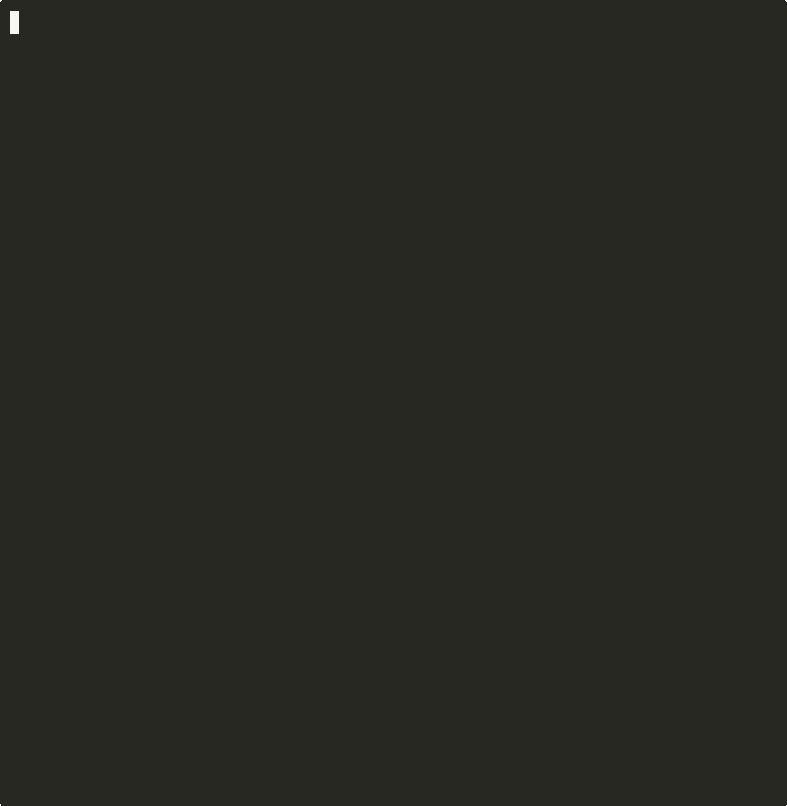

<picture>
  <source media="(prefers-color-scheme: dark)" srcset="assets/logo-dark.svg">
  <source media="(prefers-color-scheme: light)" srcset="assets/logo.svg">
  
</picture>

<br/>

**Your prompt sucks. Let's fix that.**

[](https://github.com/aytuncyildizli/reprompter/releases)
[](LICENSE)
[](https://github.com/aytuncyildizli/reprompter/stargazers)
[](https://github.com/aytuncyildizli/reprompter/issues)


---

RePrompter interviews you, figures out what you actually want, and writes the prompt you were too lazy to write yourself. **v7 merges single-prompt and team orchestration into one skill** — it detects complexity, picks execution mode, and scores everything.

Works with **Claude Code**, **OpenClaw**, or **any LLM**.

<br/>

## The Problem

You type this:

```
uhh build a crypto dashboard, maybe coingecko data, add caching, test it too, don't break existing api
```

That's a **1.6/10** prompt. The LLM will guess scope, skip constraints, hallucinate requirements, and produce something you'll rewrite anyway.

## What RePrompter Does

It turns that into a **9.0/10** prompt in ~15 seconds. No prompt engineering skills required:

<br/>
<p align="center">
  
</p>
<br/>

---

## How It Works

```
You type rough prompt
        ↓
  Quick Mode gate
        │
  Simple task? ──→ Generate immediately
        │
  Complex task? ──→ Interactive interview (clickable options)
        │                    │
        │            Complexity detection
        │            Execution mode selection
        │            Template matching
        │                    │
        ↓                    ↓
  Structured prompt ← Quality scored (before vs after)
        │
  Single agent? ──→ One polished prompt
        │
  Multi-agent? ──→ Team brief + per-agent sub-prompts
```

### Quick Mode
Simple, single-action prompts skip the interview entirely. No latency tax for `"fix the typo in header.tsx"`.

### Interactive Interview
For anything non-trivial, RePrompter asks **structured, clickable questions** — not generic fluff. If you mention "tracking", it asks tracking questions. If you mention "signals", it asks signal delivery questions.

<details>
<summary><strong>Example interview (actual shape)</strong></summary>

```json
{
  "questions": [
    {
      "header": "Task Type",
      "question": "What type of task is this?",
      "options": [
        {"label": "Build Feature", "description": "Create new functionality"},
        {"label": "Fix Bug", "description": "Debug and resolve an issue"},
        {"label": "Refactor", "description": "Improve existing code structure"},
        {"label": "Multi-Agent/Swarm", "description": "Coordinate multiple agents"}
      ]
    },
    {
      "header": "Execution Mode",
      "question": "How should this be executed?",
      "options": [
        {"label": "Single Agent", "description": "One agent handles everything"},
        {"label": "Team (Parallel)", "description": "Split into specialized agents"},
        {"label": "Team (Sequential)", "description": "Pipeline handoffs"},
        {"label": "Let Reprompter decide", "description": "Auto-detect from complexity"}
      ]
    }
  ]
}
```

</details>

### Auto Complexity Detection

| Task signal | Suggested mode |
|---|---|
| Frontend + backend + tests | Team (Parallel) |
| Fetch → transform → deploy | Team (Sequential) |
| Single file/component | Single Agent |
| Research + implementation | Team (Parallel) |

---

## Before / After

### Input
```
uhh build a crypto dashboard, maybe coingecko data, add caching, test it too, don't break existing api
```

### Output
```xml
<role>
Senior full-stack engineer for real-time dashboard systems and API integration
</role>

<context>
- Frontend + backend + tests required
- Data source: CoinGecko
- Existing API behavior must be preserved
- Execution mode: Team (Parallel) due to cross-layer scope
</context>

<motivation>
User-facing feature with reliability requirements. Prioritize correctness,
resilience, and non-breaking integration.
</motivation>

<task>
Deliver a real-time crypto dashboard backed by a cache-aware CoinGecko proxy API,
with unit tests for both API and UI, without breaking existing API contracts.
</task>

<requirements>
- Build dashboard UI with loading/error/stale states
- Implement backend CoinGecko proxy with validation + cache TTL
- Preserve backward compatibility for existing API consumers
- Add deterministic unit tests for frontend and backend
</requirements>

<constraints>
- No direct client-side calls to CoinGecko
- No breaking changes to existing API response fields
- Mock external network boundaries in tests
</constraints>

<success_criteria>
- Dashboard updates on interval and handles failures gracefully
- Proxy endpoint returns normalized, validated data
- Existing API integration tests still pass
- New unit tests cover success, error, and stale-cache paths
</success_criteria>
```

### Quality Jump

| Dimension | Before | After | Delta |
|---|---:|---:|---:|
| Clarity | 3/10 | 9/10 | +200% |
| Specificity | 2/10 | 9/10 | +350% |
| Structure | 1/10 | 10/10 | +900% |
| Constraints | 0/10 | 8/10 | +∞ |
| Verifiability | 1/10 | 9/10 | +800% |
| Decomposition | 2/10 | 9/10 | +350% |
| **Overall** | **1.6/10** | **9.0/10** | **+462%** |

---

## Team Mode

This is where RePrompter stops being "prompt cleanup" and becomes **orchestration**.

When auto-detection finds multiple systems (UI + API + tests), it generates:
1. A **team coordination brief** with handoff rules
2. **Per-agent sub-prompts** with scoped responsibilities

<details>
<summary><strong>📋 Team Brief (generated artifact)</strong></summary>

```markdown
# Reprompter Team Brief

- Execution Mode: Team (Parallel)
- Overall Task: Real-time crypto dashboard with cache-aware backend and full unit coverage

## Agent Roles
1. Frontend Agent — dashboard UI, polling behavior, loading/error/stale states
2. Backend Agent — CoinGecko proxy API, schema validation, cache strategy
3. Tests Agent — deterministic unit tests for frontend + backend behavior

## Coordination Rules
- Backend publishes API contract first
- Frontend consumes contract without shape drift
- Tests use shared DTO definitions from backend contract
- Integration checkpoint before final merge
```

</details>

<details>
<summary><strong>🎨 Frontend Agent sub-prompt</strong></summary>

```xml
<role>Senior frontend engineer specialized in real-time React dashboards</role>
<task>Implement dashboard UI for real-time crypto prices with loading, error, and stale states.</task>
<constraints>Do not call CoinGecko directly from client</constraints>
```

</details>

<details>
<summary><strong>⚙️ Backend Agent sub-prompt</strong></summary>

```xml
<role>Senior backend engineer focused on API integration and resilient caching</role>
<task>Build a cache-aware /api/prices endpoint that proxies CoinGecko and returns normalized responses.</task>
<constraints>No breaking response schema changes</constraints>
```

</details>

<details>
<summary><strong>🧪 Tests Agent sub-prompt</strong></summary>

```xml
<role>Senior test engineer specialized in deterministic unit and integration boundary tests</role>
<task>Create robust unit tests for backend API behavior and frontend rendering states.</task>
<constraints>Mock all external network boundaries, no flaky timer-dependent assertions</constraints>
```

</details>

---

## Installation

### Claude Code

```bash
mkdir -p skills/reprompter
curl -sL https://github.com/aytuncyildizli/reprompter/archive/main.tar.gz | \
  tar xz --strip-components=1 -C skills/reprompter
```

Claude Code auto-discovers `skills/reprompter/SKILL.md`.

### OpenClaw

```bash
# Copy to your OpenClaw workspace
cp -R reprompter /path/to/workspace/skills/reprompter
```

### Any Structured-Prompt LLM

Use `SKILL.md` as the behavior spec. Templates are in `resources/templates/`.

---

## Quality Dimensions

Every transformation is scored on six weighted dimensions:

| Dimension | Weight | What it checks |
|---|---:|---|
| Clarity | 20% | Is the task unambiguous? |
| Specificity | 20% | Are requirements concrete and scoped? |
| Structure | 15% | Is prompt structure complete and logical? |
| Constraints | 15% | Are boundaries explicit? |
| Verifiability | 15% | Can output be validated objectively? |
| Decomposition | 15% | Is work split cleanly (steps or agents)? |

**Overall score** = weighted average. Most rough prompts score 1–3. RePrompter typically outputs 8–9+.

---

## Templates

| Template | Use case |
|---|---|
| `feature-template` | New functionality |
| `bugfix-template` | Debug + fix |
| `refactor-template` | Structural cleanup |
| `testing-template` | Unit/integration test tasks |
| `api-template` | Endpoint/API work |
| `ui-component-template` | UI component implementation |
| `security-template` | Security hardening/audit tasks |
| `documentation-template` | Technical docs |
| `research-template` | Analysis / option exploration |
| `swarm-template` | Multi-agent coordination |
| `team-brief-template` | Team orchestration brief |

> Templates live in `resources/templates/`. Team brief is generated at runtime.

---

## v7.0 — Unified Skill + Repromptception 🧠

**v7.0 merges `reprompter` + `reprompter-teams` into a single skill with two modes.** No more separate skills — one SKILL.md handles both single prompts and full agent team orchestration.

Most agent orchestration tools improve the overall task, then hand vague sub-tasks to each agent. RePrompter individually RePrompts every agent's prompt:

```
Raw task
    ↓
Layer 1: Team Plan — roles, coordination, brief
    ↓
Layer 2: Repromptception — each agent's sub-task gets its own
         full RePrompter pass (score, improve, add constraints,
         success criteria, output format)
    ↓
Execute — every agent starts with an 8+/10 prompt
    ↓
Evaluate — score output against success criteria
    ↓
Retry (if needed) — delta prompts targeting specific gaps
```

**Before Repromptception:**
> "Security Auditor — scan for vulnerabilities"

**After Repromptception:**
```xml
<role>Senior application security engineer specializing in Python web apps</role>
<context>Codebase: Python 3, psycopg2, urllib. DB: Neon Postgres.</context>
<task>Audit all Python files for security vulnerabilities</task>
<requirements>
- Check SQL injection (parameterized vs string formatting)
- Check hardcoded secrets and API keys
- Check SSRF in URL fetching functions
- Check input validation on external API data
</requirements>
<constraints>Only audit tweet-engine dir. Report only, don't modify.</constraints>
<success_criteria>
- Minimum 3 findings with severity ratings
- Each finding: file, line number, fix suggestion
- No hallucinated file paths
</success_criteria>
```

**4-phase loop:** Team Plan → Repromptception → Execute → Evaluate+Retry

Trigger words: `"reprompter teams"`, `"repromptception"`, `"run with quality"`, `"smart run"`

Normal single-prompt usage is unchanged — Repromptception only activates for team/multi-agent tasks.

### Proven Results

**E2E test** — 3 Opus agents, sequential pipeline:

| Metric | Value |
|--------|-------|
| Original prompt score | 2.15 / 10 |
| After Repromptception | **9.15 / 10** |
| Delta | **+7.00 points (+326%)** |
| Quality audit | **PASS (99.1%)** |
| Weaknesses found → fixed | 24 → 24 (100%) |
| Cost | $1.39 |
| Time | ~8 minutes |

**Repromptception vs Raw Agent Teams** — same audit, 4 Opus agents:

| Metric | Raw | Repromptception | Delta |
|--------|-----|----------------|-------|
| CRITICAL findings | 7 | 14 | **+100%** |
| Total findings | ~40 | 104 | **+160%** |
| Cost savings found | $377/mo | $490/mo | **+30%** |
| Cross-validated findings | 0 | 5 | — |

The pipeline runs via **Claude Code Agent Teams** with `teammateMode: "tmux"` for real-time split-pane monitoring. All orchestration docs are now in SKILL.md (TEAMS.md removed in v7).

---

## Other Features

- **Think tool-aware** — Claude 4.x dedicated think tool workflows
- **Context engineering** — Prompts complement runtime context, don't duplicate it
- **Extended thinking** — Favors outcome clarity over rigid step scripting
- **Response prefilling** — Suggests `{` prefills for JSON-first API workflows
- **Uncertainty handling** — Explicit permission to ask, not fabricate
- **Motivation capture** — Maps "why this matters" into `<motivation>` so priority survives execution
- **Closed-loop quality** — Execute → Evaluate → Retry (max 2 retries, delta prompts)

---

## Contributing

Contributions welcome! See [CONTRIBUTING.md](CONTRIBUTING.md) for guidelines.

- 🐛 [Report a bug](https://github.com/aytuncyildizli/reprompter/issues/new?template=bug_report.md)
- 💡 [Request a feature](https://github.com/aytuncyildizli/reprompter/issues/new?template=feature_request.md)
- 📝 Submit a template PR

---

## License

MIT — see [LICENSE](LICENSE).

---

## Star History

<p align="center">
  <a href="https://www.star-history.com/#AytuncYildizli/reprompter&Date">
    
  </a>
</p>

---

<p align="center">
  <sub>If RePrompter saved you from writing another messy prompt, consider giving it a ⭐</sub>
</p>
