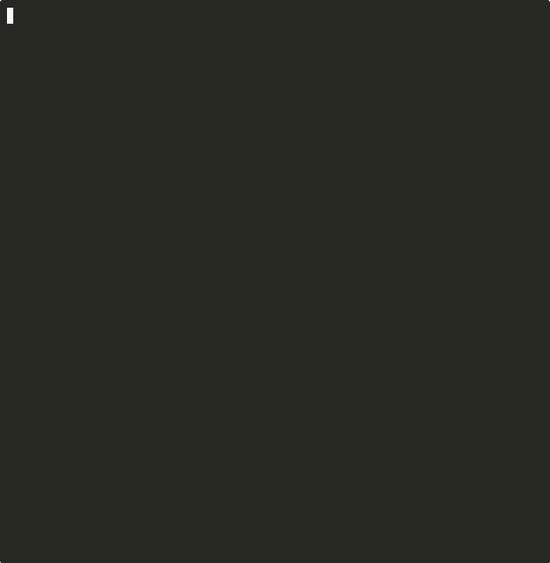

<picture>
  <source media="(prefers-color-scheme: dark)" srcset="assets/logo-dark.svg">
  <source media="(prefers-color-scheme: light)" srcset="assets/logo.svg">
  
</picture>

<br/>

**Your prompt sucks. Let's fix that.**

[](https://github.com/aytuncyildizli/reprompter/releases)
[](LICENSE)
[](#testing)
[](https://github.com/aytuncyildizli/reprompter/stargazers)

RePrompter is a prompt engineering skill for AI coding agents. It takes rough, low-quality prompts and transforms them into structured, high-scoring prompts that produce dramatically better results. Works with Claude Code, OpenClaw, Codex, Grok CLI, Hermes Agent, or any LLM that accepts structured prompts.

<br/>
<p align="center">
  
</p>

---

## Five Output Lanes

| Lane | What it does | Trigger |
|------|-------------|---------|
| **Single** | Interview, structure, score one prompt | `reprompt this`, `clean up this prompt` |
| **`/goal` preflight** | Codex CLI, Claude Code CLI v2.1.139+, or Hermes Agent: infer intent, build the expanded prompt, then compress it into `/goal <summary of expanded prompt>` | `before /goal`, `for /goal`, `Codex /goal`, `Claude Code /goal`, `Hermes /goal`, `/goal preflight` |
| **Repromptverse** | Plan a team of 2-5 agents, reprompt each one, execute in parallel, evaluate, retry | `reprompter teams`, `repromptverse`, `smart run` |
| **Reverse** | Show a great output, extract the prompt DNA that produced it | `reverse reprompt`, `learn from this`, `prompt dna` |
| **Workflow preflight** | Compile a reprompted task into a runnable Claude `.workflow.js` (pure-literal `meta`, schema returns, bounded retry; ultracode adds adversarial verify + completeness critic); also Repromptverse Option H | `compile to workflow`, `workflow preflight`, `build a workflow script`, `dynamic workflow` |

---

## Before / After

```
Input:  "uhh build a crypto dashboard, maybe coingecko data, add caching, test it too"
Score:  1.6/10
```

```xml
Output: Structured XML prompt with role, context, task, requirements,
        constraints, output format, and success criteria
Score:  9.0/10  (+462%)
```

<details>
<summary>See the full generated prompt</summary>

```xml
<role>
Senior full-stack engineer specializing in real-time dashboard systems,
REST API integration, and cache-aware data pipelines.
</role>

<context>
- Frontend + backend + tests required (cross-layer scope)
- Data source: CoinGecko API (free tier, 30 calls/min rate limit)
- Existing API behavior must be preserved
</context>

<task>
Deliver a real-time crypto dashboard backed by a cache-aware CoinGecko proxy API,
with unit tests for both API and UI, without breaking existing API contracts.
</task>

<requirements>
- Build dashboard UI with loading, error, empty, and stale-data states
- Implement backend CoinGecko proxy with JSON schema validation + configurable cache TTL
- Preserve backward compatibility for all existing API consumers
- Add deterministic unit tests for frontend rendering states and backend edge cases
- Cache must serve stale data on upstream failure (stale-while-revalidate pattern)
</requirements>

<constraints>
- No direct client-side calls to CoinGecko (all traffic through proxy)
- No breaking changes to existing API response fields or status codes
- Mock all external network boundaries in tests
- Rate limit CoinGecko calls to stay within free tier (30/min)
</constraints>

<output_format>
- Backend: /api/prices endpoint returning { prices: [...], cached: bool, updatedAt: ISO }
- Frontend: React component with 5s auto-refresh interval
- Tests: Vitest suite with >=80% branch coverage
</output_format>

<success_criteria>
- Dashboard auto-updates every 5s and shows "stale" indicator when cache is old
- Proxy returns normalized data within 200ms (cache hit) / 2s (cache miss)
- Existing API integration tests still pass with zero modifications
</success_criteria>
```
</details>

| Dimension | Before | After | Change |
|-----------|-------:|------:|-------:|
| Clarity | 3 | 9 | +200% |
| Specificity | 2 | 9 | +350% |
| Structure | 1 | 10 | +900% |
| Constraints | 0 | 8 | new |
| Verifiability | 1 | 9 | +800% |
| Decomposition | 2 | 9 | +350% |
| **Overall** | **1.6** | **9.0** | **+462%** |

> Scores are self-assessed. Treat as directional indicators, not absolutes.

---

## Install

### Claude Code

Recommended: install the Claude Code plugin. One install registers the RePrompter skill namespace and the Ambient Prompt Gate hook; future updates use Claude Code's native plugin update flow.

```text
/plugin marketplace add AytuncYildizli/reprompter
/plugin install reprompter@reprompter
```

If you previously installed `~/.claude/skills/reprompter`, remove that personal copy before using the plugin. Personal skills shadow/duplicate plugin skills, so leaving it in place can make Claude Code load the old copy instead of `/reprompter:reprompter`.

The plugin ships the Ambient Prompt Gate enabled for Claude Code `UserPromptSubmit`. Use `REPROMPTER_AMBIENT=0` as the per-feature off switch; Claude Code's `disableAllHooks` still disables all hooks, including plugin hooks.

Fallback for copy-based or non-plugin setups:

```bash
mkdir -p skills/reprompter
curl -sL https://github.com/aytuncyildizli/reprompter/archive/main.tar.gz | \
  tar xz --strip-components=1 -C skills/reprompter
```

Source archives are runtime-only (`.gitattributes` `export-ignore`): they contain `SKILL.md`, `references/`, and `scripts/` but not dev/dist trees like `skills/` (the Hermes-only install package — see [Install paths](#openclaw--codex--grok-cli--hermes-agent)), `plugin/`, `.claude-plugin/`, `benchmarks/`, `assets/`, or `docs/`. Plugin installs use git clone through Claude Code's marketplace flow, so export-ignoring the plugin tree does not affect plugin installs. Installed an older full copy? It's safe to delete those directories from it — upgrades won't bring them back.

For the `/goal` preflight lane on Claude Code, pin the CLI to **v2.1.139 or later**. `/goal` depends on the hooks layer — if `disableAllHooks` or `allowManagedHooksOnly` is set in `settings.json` the command is unavailable on any version (v2.1.140 only made the failure visible). Managed environments that block hooks should stick to Single mode for goal-shaped work.

```bash
claude --version
# Expect 2.1.139 or later. Upgrade if older.
```

### Staying current (version self-check)

Copy-based RePrompter installs can tell you when they are behind the latest release. Claude Code plugin installs stay silent here because native plugin update detection owns freshness. On the first invocation in a copy-based session, RePrompter runs a **fail-soft** check (`scripts/version-check.js`) that compares your local `SKILL.md` version against the latest GitHub release and prints a notice **only if you're behind** (silent when up to date). The result is cached ~24h (keyed by repo), so repeat runs add no latency; the first uncached check waits up to ~3s for GitHub, then fails soft and silent if it can't reach it (a failed lookup is cached ~1h so offline sessions don't repeat the timeout). Disable it entirely with `REPROMPTER_VERSION_CHECK=0`.

The notice's upgrade command is **path-aware**: it re-fetches into the exact directory this skill is installed in, so it works the same whether you run Claude Code (`~/.claude/skills/reprompter`), Codex (`~/.codex/skills/reprompter`), OpenClaw, Grok CLI, or a project-local `skills/reprompter/`. (Hermes installs ship no `scripts/`, so the check doesn't run there — use `hermes skills install` to update.)

Run it manually any time:

```bash
cd skills/reprompter                   # run from the skill's install dir (where scripts/ lives)
node scripts/version-check.js          # prints a notice only if behind; silent otherwise
node scripts/version-check.js --json   # explicit status: {local, latest, behind, notice}
```

To get nudged at session start (Claude Code, opt-in), add a `SessionStart` hook in `~/.claude/settings.json`:

```json
{
  "hooks": {
    "SessionStart": [
      { "hooks": [ { "type": "command", "command": "node /absolute/path/to/skills/reprompter/scripts/version-check.js" } ] }
    ]
  }
}
```

Because a skill is cached per session, after updating you must start a **new** session for the new version to load.

### OpenClaw / Codex / Grok CLI / Hermes Agent

Root `SKILL.md` is canonical for Claude Code, Codex, OpenClaw, Grok, and direct GitHub browsing. `skills/reprompter/` is the Hermes-only installable package, generated from root and sanitized for Hermes Skills Guard.

Run copy-based installs from the parent directory that contains a cloned or downloaded `reprompter/` folder:

```bash
mkdir -p /path/to/workspace/skills
cp -R reprompter /path/to/workspace/skills/
```

For Hermes Agent v0.14+, prefer the generated install package so Skills Guard scans only the runtime skill artifact:

```bash
hermes skills install AytuncYildizli/reprompter/skills/reprompter
```

Avoid using the two-part Hermes identifier as the primary install command because it can resolve stale marketplace content:

```bash
hermes skills install AytuncYildizli/reprompter
```

Hermes Agent's default manual skill location is `~/.hermes/skills/reprompter/`. The `skills/` package is excluded from GitHub source archives, so a manual copy needs a **git clone** (or any `hermes skills install` form above), not a tarball/ZIP download:

```bash
git clone https://github.com/AytuncYildizli/reprompter.git
mkdir -p ~/.hermes/skills
cp -R reprompter/skills/reprompter ~/.hermes/skills/
```

For Codex, install or update the CLI and confirm the goals feature is available:

```bash
npm install -g @openai/codex@latest
codex --version
codex features list | grep '^goals'
```

If `goals` is present but disabled, set `features.goals = true` in `~/.codex/config.toml` and start a fresh Codex session before using `/goal`.

### Any LLM

Use `SKILL.md` as the behavior spec. Templates are in `references/`.

---

## Quick Start

```
reprompt this: build a REST API with auth and rate limiting
```

### `/goal` Preflight

Use RePrompter before `/goal` whenever the goal is bigger than a single direct instruction. The lane works on **Codex CLI** (any version exposing the `goals` feature), **Claude Code CLI v2.1.139+** (native `/goal` slash command shipped on 2026-05-11), and **Hermes Agent** (persistent goals in the v0.13.0 / 2026.5.7 release). These runtimes shape the command as `/goal <objective>`, so RePrompter first builds the full expanded prompt, then compresses it into a dense copy-pasteable `/goal <summary of expanded prompt>` command. The command should read like a summary of the old long XML prompt, not a tiny rewrite of the rough input.

```
reprompt this for /goal: migrate our billing dashboard to the new API without breaking existing reports
```

Add an explicit runtime marker when you have one — "Codex /goal", "Claude Code /goal", or "Hermes /goal" — otherwise RePrompter will ask. RePrompter then shows a Goal Command Card:

| Field | Example (Claude Code) |
|-------|---------|
| Goal Command | `/goal Migrate billing dashboard API usage to the new API by first mapping current data/report consumers, preserving schemas, filters, exports, scheduled outputs, and historical totals, implementing the smallest compatible adapter changes, adding parity fixtures, and proving compatibility with unit, integration, dashboard smoke, and report export checks.` |
| Compressed From | Expanded RePrompter prompt |
| Objective | Migrate billing dashboard API usage without breaking reports |
| Runtime | Claude Code CLI (≥ v2.1.139) |
| Mode | `/goal preflight` |
| Paste Into | Claude Code TUI prompt, as-is |
| Risk Level | medium |
| Missing Inputs | API contract diff, report smoke path |
| Verification | `npm run check`, dashboard smoke, report export check |
| Quality | 3/10 → 8/10 |

For Codex or Hermes, the Card differs only in the `Runtime` (`Codex CLI` or `Hermes Agent`) and `Paste Into` rows.

Then run the generated command in your chosen runtime:

```
/goal Migrate billing dashboard API usage to the new API by first mapping current data/report consumers, preserving schemas, filters, exports, scheduled outputs, and historical totals, implementing the smallest compatible adapter changes, adding parity fixtures, and proving compatibility with unit, integration, dashboard smoke, and report export checks.
```

On Claude Code (v2.1.139+) the goal is **thread-persistent** — it survives `/resume`, terminal close, and context compaction — and a Haiku evaluator checks the completion condition against the transcript after each turn. Use `/goal pause` and `/goal resume` to handle interruptions. On Codex (alpha) the same `/goal <objective>` shape applies once `features.goals = true` in `~/.codex/config.toml` and a fresh session is started. On Hermes Agent, `/goal` is also persistent and supports `/goal status`, `/goal pause`, `/goal resume`, and `/goal clear`; Hermes defaults to a bounded continuation loop and survives `/resume`.

For automation surfaces such as Whip, the same contract is available as a local
runtime command:

```bash
node scripts/goal-command.js \
  --input "migrate our billing dashboard to the new API without breaking reports" \
  --target codex \
  --out-dir /tmp/reprompter-goal
```

It writes `goal-command.json`, `goal-command.txt`,
`goal-command-card.json`, `reprompter-expanded-prompt.md`, and
`compressed-goal-summary.txt`. The command is artifact generation only; it does
not execute `/goal`, dispatch agents, read secrets, or touch production. The same `/goal <objective>` output also pastes directly into Claude Code v2.1.139+ and Hermes Agent — dedicated `--target claude-code` / `--target hermes` switches are planned for a follow-up release; until then the existing `--target codex` artifact text is shape-compatible with both `/goal` surfaces.

```
reprompter teams - audit the auth module for security and test coverage
```

```
reverse reprompt this: [paste a great output you want to reproduce]
```

RePrompter interviews you (2-5 questions), generates a structured XML prompt, and shows a before/after quality score.

---

## How It Works

### Single Mode

```
Rough prompt → Input guard → Quick mode gate → Interview (2-5 questions)
→ Template selection → XML prompt generation → Quality scoring → Delta rewrite if < 7/10
```

17 templates cover feature, bugfix, refactor, testing, API, UI, security, docs, content, research, and multi-agent swarm patterns.

### Repromptverse Mode

```
Phase 1: Score prompt, interview if needed, plan team, show Plan Cards → user approves
Phase 2: Write XML prompt per agent (target 8+/10), show quality scorecard
Phase 3: Execute (tmux / TeamCreate / Workflow tool / OpenClaw / Codex / Grok CLI / Hermes Agent / sequential fallback)
Phase 4: Show Result Cards, evaluate, retry with delta prompts if needed (max 2)
```

Agents get non-overlapping scopes, explicit success criteria, and file:line reference requirements. The evaluator loop ensures quality before synthesis.

### Reverse Mode

```
Exemplar output → EXTRACT structure → ANALYZE task type + domain + tone
→ SYNTHESIZE XML prompt → Score → Optional: INJECT into flywheel
```

11 task type classifiers (code review, security audit, architecture doc, API spec, test plan, bug report, PR description, documentation, content, research, ops report) with 8 domain detectors and tone analysis. Solves the flywheel cold-start problem by seeding it with known-good prompt/output pairs.

---

## Key Features

**Closed-Loop Flywheel (v12)** - The loop is now end-to-end. Every prompt emits a `<success_criteria>` block of testable assertions. After execution, `scripts/outcome-record.js` writes a structured record joining prompt + criteria + output; `scripts/evaluate-outcome.js` scores it against the criteria (regex / predicate / llm_judge / manual). Records feed into a local flywheel via `npm run flywheel:ingest`. At generation time, `REPROMPTER_FLYWHEEL_BIAS=1` makes the skill consult past outcomes and bias toward historically winning recipes. `npm run flywheel:ab` compares bias-on vs bias-off effectiveness so you can *prove* whether the bias is helping. All data local.

**Prompt Flywheel Recipe Fingerprinting** - Every prompt carries a deterministic recipe fingerprint (template + patterns + capability tier + domain + context layers + quality bucket). Strategy learner groups outcomes by fingerprint so recommendations are grounded in repeated evidence, not one-off runs.

**Ambient Prompt Gate (v12.8)** - An opt-in Claude Code `UserPromptSubmit` hook scores task-shaped prompts locally and silently nudges only when the request is below threshold. It is fail-soft, never blocks a prompt, uses cooldown to avoid nagging, and writes no prompt text to the local outcome log (called telemetry in the code) or state.

**Agent Cards** - Plan Cards (before execution), Status Line (during), Result Cards (after). Full transparency into what agents will do, are doing, and found.

**Dimension Interview** - Low-scoring prompt dimensions trigger targeted questions. No more vague prompts spawning expensive agents.

**Pattern Library** - 6 pluggable prompt engineering patterns: constraint-first framing, uncertainty labeling, self-critique checkpoints, delta retry scaffolds, evidence-strength labeling, context-manifest transparency.

**Capability Routing** - When multiple models are available, routes each agent by capability tier (reasoning, long context, cost-optimized, latency-optimized) with provider-diverse fallback chains.

## Privacy

RePrompter never transmits or collects anything from anyone. The Ambient Prompt Gate and flywheel write **local files only** on the user's own machine:

- Gate state and outcome log: `$XDG_CACHE_HOME/reprompter/`
- Flywheel and runtime telemetry runs: `.reprompter/`

No prompt text is ever persisted. Session ids are sha256-hashed before they are written.

The single network call in the entire product is the version self-check (`scripts/version-check.js`) querying the GitHub releases API for the latest RePrompter release. It sends no user data and can be disabled with `REPROMPTER_VERSION_CHECK=0`.

You can inspect the local files, delete them anytime, and kill the gate log with `REPROMPTER_TELEMETRY=0`. To verify the local-only gate directly, read `scripts/prompt-gate.js`: it has no network imports.

---

## Testing

```bash
npm run check    # 303 tests + 4 benchmarks
npm run test:reverse-engineer  # individual suite example
```

| Suite | Tests |
|-------|------:|
| Intent router | 25 |
| Reverse engineer | 43 |
| Outcome collector | 43 |
| Strategy learner | 36 |
| Recipe fingerprint | 14 |
| Repromptverse runtime | 9 |
| Capability policy | 7 |
| Pattern selector | 7 |
| Runtime adapter | 5 |
| Flywheel E2E | 5 |
| Context builder | 3 |
| Artifact evaluator | 4 |
| Goal command | 11 |
| Workflow command | 20 |
| Version check | 20 |
| Prompt gate | 23 |
| Hermes package | 8 |
| Claude Code plugin package | 9 |
| Telemetry schema/store | 6 |
| Observability report | 2 |
| Observability contract | 3 |
| **Total** | **303** |

All benchmarks at 100%: swarm routing (9/9), real-world routing (64/64), artifacts (84/84), flywheel (13/13), provider (9/9).

---

## Compatibility

| Capability | Claude Code | Codex | OpenClaw | Grok CLI | Hermes Agent | Any LLM |
|-----------|:-:|:-:|:-:|:-:|:-:|:-:|
| Single mode | yes | yes | yes | yes | yes | yes |
| `/goal` preflight | yes¹ | yes | - | - | yes² | - |
| Reverse mode | yes | yes | yes | yes | yes | yes |
| Multi-agent parallel | yes | yes | yes | yes | yes | - |
| Multi-agent sequential | yes | yes | yes | yes | yes | yes |
| Workflow preflight / Option H | yes³ | - | - | - | - | - |

¹ Claude Code `/goal` requires CLI v2.1.139+ (shipped 2026-05-11) and depends on the hooks layer. Under `disableAllHooks` or `allowManagedHooksOnly` in `settings.json`, `/goal` is unavailable on any version — v2.1.140 only upgraded the failure mode from a silent hang to a clear error message. No config flag needed beyond the version pin in environments that permit hooks; managed environments that block hooks must use Single mode for goal-shaped work.

² Hermes Agent `/goal` is documented in the v0.13.0 / 2026.5.7 release. It uses the same `/goal <objective>` command shape, with `/goal status`, `/goal pause`, `/goal resume`, and `/goal clear` available in the runtime.

Codex parallel paths: **D1 native subagents** (Codex CLI 0.121.0+, `multi_agent` default-enabled) or **D2 shell-level** (`codex exec --ephemeral --sandbox workspace-write` + background + `wait`; workspace-write is required for workers to write their `/tmp/rpt-*.md` artifacts, and `codex exec` keeps approval = `never` automatically). See SKILL.md Option D and `references/runtime/codex-runtime.md`.

Grok parallel paths: **F1 native subagents** (`spawn_subagent`) or **F2 shell-level** (`grok -p ... &` + `wait`). Grok does not expose `/goal`.

Hermes parallel paths: **G1 `delegate_task` batch** for normal Repromptverse, **G2 shell-level** (`hermes -z` / `hermes chat -q` + background + `wait`) for external orchestration, or **G3 Kanban** for durable multi-profile workflows. See `references/runtime/hermes-agent-runtime.md`.

³ Claude dynamic Workflow tool (**Option H** + the **Workflow preflight** lane): RePrompter compiles the reprompted task into a runnable `.workflow.js` (JS-scripted background fan-out — `agent()`/`parallel()`/`pipeline()` with schema-validated returns and `resumeFromRunId`). Picked at Order 4, just below Option B, because the Workflow tool has no mid-run cross-agent messaging. First-class ultracode (adversarial verify + completeness critic + budget-scaled fleets) with a `--no-ultracode` off-ramp. See `references/runtime/claude-workflow-runtime.md`. Compiler: `scripts/workflow-command.js`.

---

## Configuration

### Ambient Prompt Gate (Claude Code)

Plugin installs register this hook automatically. For copy-based installs, add it manually:

```json
{
  "hooks": {
    "UserPromptSubmit": [
      { "hooks": [ { "type": "command", "command": "node /absolute/path/to/skills/reprompter/scripts/prompt-gate.js" } ] }
    ]
  }
}
```

Ambient flags: `REPROMPTER_AMBIENT=0` disables nudges, `REPROMPTER_AMBIENT_THRESHOLD` changes the default score threshold (`5`), `REPROMPTER_AMBIENT_COOLDOWN_MIN` changes the per-session cooldown (`15`), and `REPROMPTER_TELEMETRY=0` disables the privacy-safe gate local outcome log. Claude Code's `disableAllHooks` still wins globally. The gate never blocks prompts and never persists prompt text.

### Repromptverse

```json
// ~/.claude/settings.json
{
  "env": {
    "CLAUDE_CODE_EXPERIMENTAL_AGENT_TEAMS": "1"
  },
  "preferences": {
    "model": "opus"
  }
}
```

Feature flags: `REPROMPTER_FLYWHEEL`, `REPROMPTER_POLICY_ENGINE`, `REPROMPTER_LAYERED_CONTEXT`, `REPROMPTER_STRICT_EVAL`, `REPROMPTER_PATTERN_LIBRARY`, `REPROMPTER_TELEMETRY` (all `0|1`, enabled by default).

---

## Architecture

```
SKILL.md                        # Behavior spec (the product)
references/                     # 18 templates (XML + markdown)
  feature-template.md
  bugfix-template.md
  reverse-template.md
  marketing-swarm-template.md
  ...
scripts/                        # Runtime engine
  intent-router.js              # Mode + profile routing
  reverse-engineer.js           # Exemplar analysis + prompt extraction
  capability-policy.js          # Model selection + fallback chains
  context-builder.js            # Token-budgeted context assembly
  artifact-evaluator.js         # Output quality gates
  pattern-selector.js           # Pluggable prompt patterns
  recipe-fingerprint.js         # Strategy hashing
  outcome-collector.js          # Flywheel data capture
  strategy-learner.js           # Historical recommendation engine
  repromptverse-runtime.js      # Orchestration composer
```

---

## Contributing

See [CONTRIBUTING.md](CONTRIBUTING.md). PRs welcome.

## License

[MIT](LICENSE)
